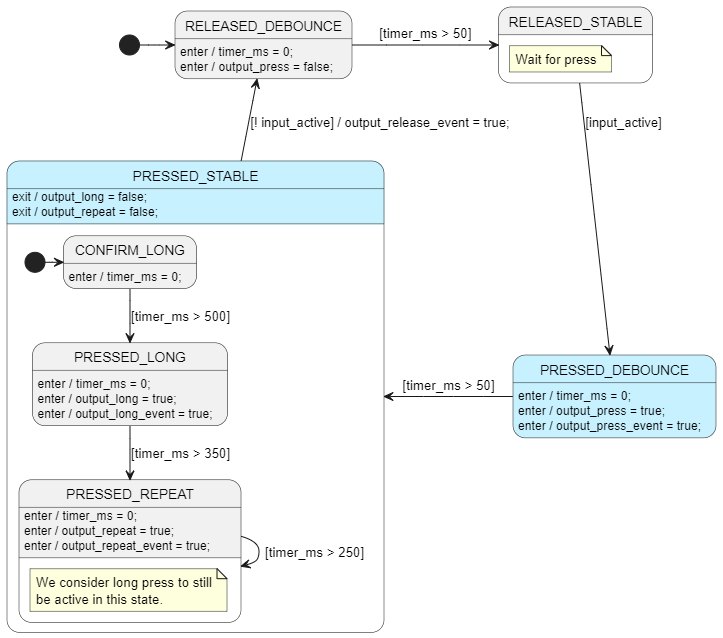
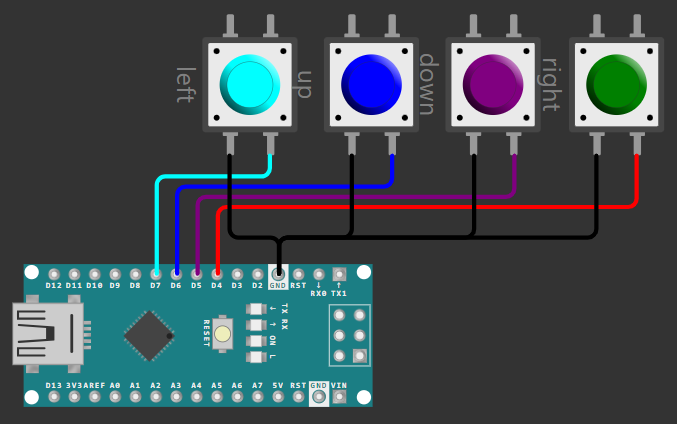

> Assumes that you have gone through basic StateSmith tutorial 3 already.

# Design
Cross platform design that can be easily generated for any desired language although the simulation example uses C++/Arduino.

This is a simple button state machine that is ready for customization to your specific needs. It debounces, outputs long press and repeat events (like a keyboard).

Button repeat events are great for user interfaces. Simply hold the button down and the event will repeat. This is useful for scrolling through a list or increasing/decreasing a value.

## Benefits
- Uses very little RAM. Will use even less when a future StateSmith algorithm is added.
- Simple example of a state machine that operates purely on inputs and outputs (no function calls).
- Shows how to save RAM by using bit fields.
- Perfectly portable to any platform. Just change the StateSmith config in the plantuml file to match your desired programming language.

## Diagram
Obviously feel free to customize. This is just a starting point.

 

# Simulation
https://wokwi.com/projects/404077364081010689

 

# Usage
See `.ino` file for usage or the [simulation link](https://wokwi.com/projects/404077364081010689).

## Variables
See `RenderConfig.AutoExpandedVars` in plantuml file to see how the state machine variables are defined.

## Inputs
- `timer_ms` - you need to add your loop time to this variable in your main loop.
- `input_active` - set this to 1 when button is pressed, 0 when not pressed.

## Output Event Variables
Read these event flags after running the state machine. You need to clear them after reading them.
- `output_press_event` - set when button is first pressed.
- `output_long_event` - set when button has been held for a long time.
- `output_repeat_event` - repeated event after long press. Like how a keyboard key repeats when held down.
- `output_release_event` - set when button is released.

## Output Status Flag Variables
Read these status flags after running the state machine, but don't clear them. They are set/cleared automatically.

- `output_press` - button is considered pressed.
- `output_long` - button has been held for a long time.
- `output_repeat` - button is in repeating state. Not sure if this is useful.

