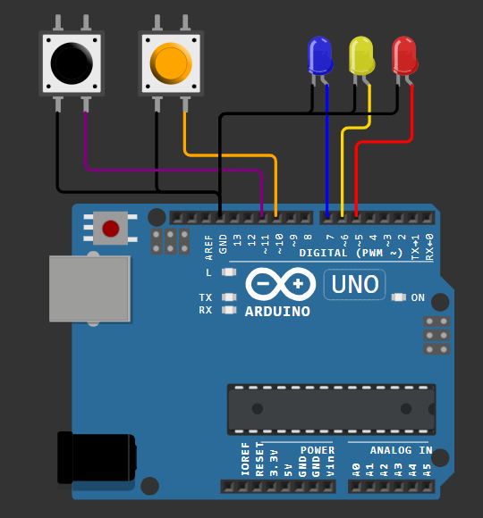

# Multiple Buttons Controlling Multiple LEDs

Assumes that you have gone through basic StateSmith tutorials already.

This example shows:
- How to connect state machines together through variables & events.
- How to create multiple instances of a state machine.
- Parent to child transition.

# Design
A nice and simple light controller.

Online Arduino simulation: https://wokwi.com/projects/406891275360211969

