# Intro
This tutorial will show you how to:
* use StateSmith CLI (`ss.cli`) to create a PlantUML state machine
* use StateSmith CLI (`ss.cli`) to generate C99 code from a single PlantUML file (no .csx file)
* connect the generated state machine to a simple LED controller without StateSmith expansions

You can see the completed tutorial in [../c-include-sm-basic-2-plantuml](../c-include-sm-basic-2-plantuml/).

# Note for Arduino
Arduino IDE doesn't like `.inc` files. You can use `.inc.h` instead. See [here for details](https://github.com/StateSmith/StateSmith/issues/361).

# Pre-requisites
* Basic [StateSmith install](https://github.com/StateSmith/StateSmith/wiki/StateSmith-install-requirements).
* StateSmith.Cli **0.9.1** or later.

This tutorial assumes you will be using `gcc`. If on Windows, use WSL, Cygwin, or MinGW... or modify the tiny build script to use a different compiler.

# Instructions
Follow the steps below.

To make it easier to focus on just this example project, I recommend opening your editor/terminal in this directory instead of main examples directory.


## Step 1 - Compile and Run
Let's check that the "blank" project compiles and runs before making any changes.

Run the following command:

```bash
./gcc-compile-run.sh
```

You should see some warnings about unused functions and variables. This is expected. They will be used when you implement the state machine.
```
LightController.c:96:13: warning: ‘leds’ defined but not used [-Wunused-function]
   96 | static void leds(uint8_t i)
      |             ^~~~
LightController.c:68:12: warning: ‘count’ defined but not used [-Wunused-variable]
   68 | static int count = 0;
      |            ^~~~~
```

The program will also print usage instructions:
```
USAGE:
  type i <enter> to send INCREASE event to state machine.
  type d <enter> to send DIM event to state machine.
  type t <enter> to send TOGGLE event to state machine.

Hit <enter> to start
```

Until your state machine is implemented, the keys `i`, `d`, and `t` are hard coded as follows:
- `i` turns on 2 LEDs: `[##_]`
- `d` turns on 1 LED:  `[#__]`
- `t` turns off all LEDs: `[___]`


<br>

## Step 2 - Create State Machine From Template
We are going to use `ss.cli` to create a PlantUML state machine from a template.

Type the following command and hit enter:

```
ss.cli
```

Use the arrow keys to select `Create` and hit enter.<br>
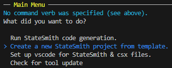

Select `User Friendly` and hit enter.<br>
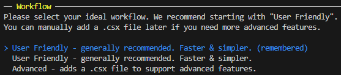

Type in the name of the state machine `LightSm` and hit enter.<br>
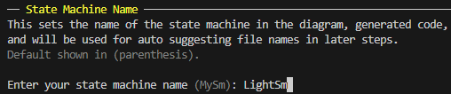

Select `C99` and hit enter.<br>
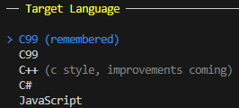

Select `PlantUML` and hit enter.<br>
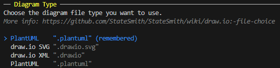

Take the default suggestion for diagram name/path by hitting enter.<br>
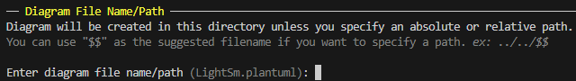

Select simple template and hit enter.<br>
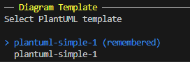

Select `yes` to confirm and hit enter.<br>
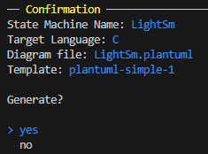

You should now see a `LightSm.plantuml` file in this directory.


<br>

## Step 3 - Implement State Machine
Open `LightSm.plantuml` in a text editor and replace the diagram contents with the following:

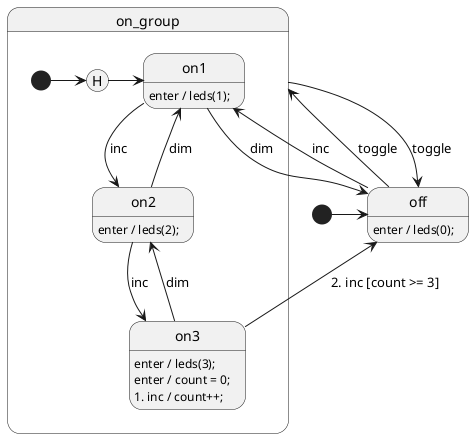

Save the file.


<br>

## Step 4 - Generate State Machine C Code
We are going to use the `ss.cli` to generate the C code for the state machine.

Instead of using the interactive menu, we are going to use the command line `run` verb.

```bash
ss.cli run --here
```

You should see the following files be generated:<br>
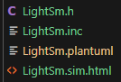

You should be able to run `./gcc-compile-run.sh` and see no errors. It will function the same as before. **NOTE!** We haven't connected the state machine to the LEDs yet. This will be done in the next step.


<br>

## Step 5 - Connect State Machine to LEDs
Open `LightController.c` in a text editor and follow the `TODO` instructions in the file like below:

```c
void LightController_init(void)
{
    // LightSm_ctor(&state_machine);  // TODO uncomment when LightSm is ready
    // LightSm_start(&state_machine);  // TODO uncomment when LightSm is ready
    leds_off();  // TODO remove when LightSm is ready
}
```

Uncomment and remove the necessary lines. The above code should look like this:

```c
void LightController_init(void)
{
    LightSm_ctor(&state_machine);
    LightSm_start(&state_machine);
}
```

Save the file and run `./gcc-compile-run.sh`. You should now see the LEDs change according to the state machine.


<br>

## Step 6 - Explore the Simulation
As of 2024-06-30, the simulation is quite basic, but is actually quite useful for new users and quickly playing with a design (especially if it uses history states).

Open `LightSm.sim.html` with a regular web browser. You should see the following:<br>
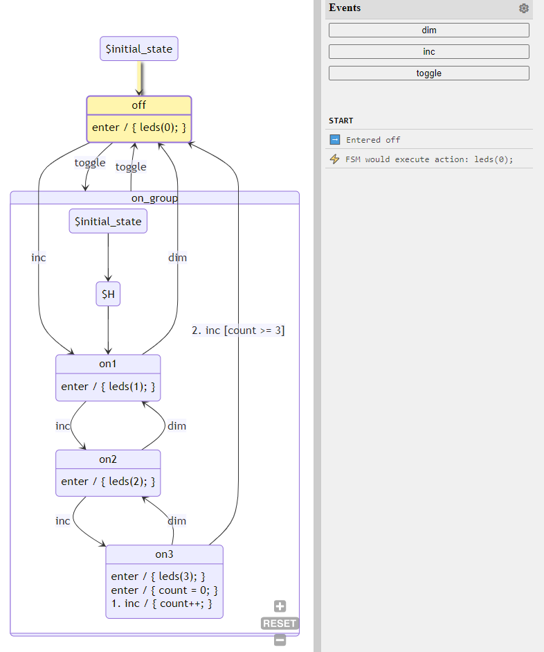

Click the event buttons in the top right corner to see the state machine transition.

NOTE! The simulator doesn't try to evaluate guards or actions. You can see this if you get to the `on3` state and click the `inc` button.

The simulator will prompt you to evaluate the guard condition. Click "OK" to specify that the guard condition is true.<br>

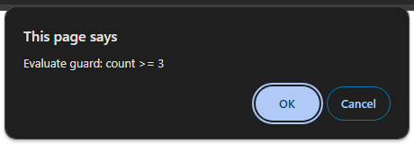
