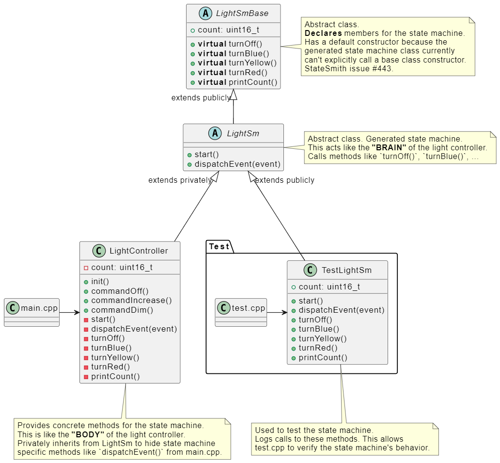
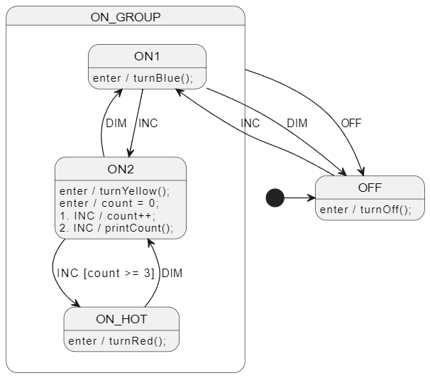

# State Machine Extends User Interface

As discussed in [tutorial 3](https://github.com/StateSmith/tutorial-3/tree/main/lesson-3), StateSmith allows you to connect your state machine to other code in many different ways.

This is just one of them. See also [cpp-inheritance-2](../cpp-inheritance-2/README.md).

## Pros
+ Easy to test state machine.
+ User code is written in usual c++ files.
+ LightController provides clean API to main.cpp.

## Cons
- One more class/file (LightSmBase) compared to [cpp-inheritance-2](../cpp-inheritance-2/README.md) example.

## Hierarchy



## Diagram
See [LightSm.plantuml](./LightSm.plantuml) for the PlantUML code.




<br>

# Run The Code Gen
Run in this directory:
```
ss.cli run -h
```


<br>

# Run The Example Project
This example uses gcc for convenience, but you can use any C++11 compiler you like.

The only GCC specific things are:
- the tiny build shell script `build_run.sh`

Run in this directory:
```
./build_run.sh
```
