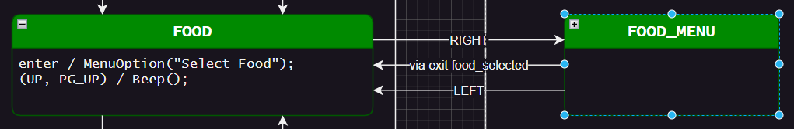
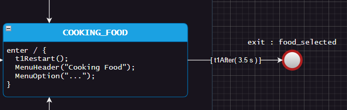
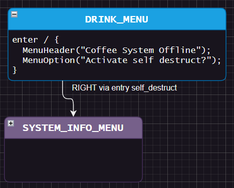
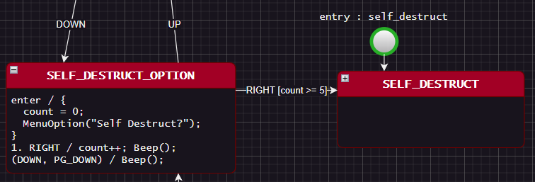
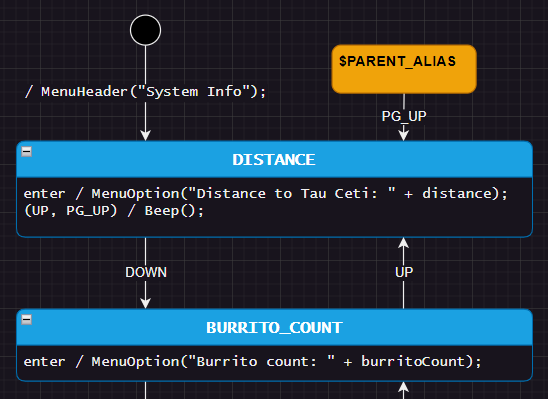

# Welcome Space Travelers!

This example project shows how to use StateSmith to create a space ship menu system.

It is also our first example project that specifically targets the C# language. Feedback welcome!

```
         ████                                         
       ██    ██        WELCOME TO SPACE CONTROL!      
     ██  ▓▓▓▓  ██                                     
     ██  ▓▓▓▓  ██      ENJOY YOUR TIME HERE.          
   ██            ██    THE MUSH IS AWFUL, BUT THE     
   ██    ▓▓▓▓    ██    COFFEE IS GOOD.                
   ██            ██                                   
     ██  ▓▓▓▓  ██      USE THE ARROW KEYS TO NAVIGATE 
   ██▒▒██    ██▒▒██    THE SPACE SHIP CONTROL SYSTEM. 
   ██▒▒████████▒▒██                                   
   ██▒▒██    ██▒▒██                                   
     ██        ██   
```


<br>

# Assumptions
Assumes you have already completed [tutorial-2](https://github.com/StateSmith/tutorial-2) and have basic working knowledge of how to use StateSmith.


<br>

# Open This Directory With vscode
This directory has a .vscode directory that will load the StateSmith plugin when you open the [./Ui/UiSm.drawio](./Ui/UiSm.drawio) draw.io file.


<br>

# Commands
Run the StateSmith code gen with:
```
dotnet-script ./Ui/UiSm.csx
```

Run the C# application with command `dotnet run` in this directory or use the Visual Studio project.


<br>

# Areas of Interest
There are a few areas that this example explores beyond what is in the basic tutorials.


## Thread Safety
The example shows how you can queue up state machine events from other threads. StateSmith generated code is not thread safe. You have to protect against concurrency issues. We can make this automatic in the future if a common concurrency pattern is desired by the community.


## Exit Points
Exit points are very helpful for exiting a collapsed state.

Consider the `FOOD_MENU` state on the right. It is collapsed, but nested states within it need a way of transitioning back to `FOOD` when a food item has been selected.

This is achieved with `via exit food_selected`.



Inside `FOOD_MENU`, you can see that the `COOKING_FOOD` state transitions to exit point `food_selected`. The exit point continues transitioning to the `FOOD` state.




## Entry Points
Entry points are very similar to Exit points. They allow you jump directly into a nested state.

Consider the `RIGHT via entry self_destruct` transition from `DRINK_MENU` to `SYSTEM_INFO_MENU`.



It jumps directly to the `SELF_DESTRUCT` state inside `SYSTEM_INFO_MENU`.




## Parent Alias
Also useful for working inside collapsed states.

Inside `SYSTEM_INFO_MENU`, we can use `$PARENT_ALIAS` to refer to `SYSTEM_INFO_MENU`.

In this example, we have a `SYSTEM_INFO_MENU` behavior that will transition to state `DISTANCE` on the `PG_UP` event. `PG_UP` to jump to the top of the menu. `PG_DOWN` to jump to the bottom of the menu.




## Be Careful With Nesting
While the `SELF_DESTRUCT` state prevents you from exiting it via the LEFT key (AKA go back), it doesn't override ancestor behaviors for `ESC`, `PG_UP` or `PG_DOWN` so those
will still allow you to prevent the self destruction.

If you really wanted to prevent any event from exiting the `SELF_DESTRUCT` state, you could have it override/eat all events. StateSmith doesn't have convenient syntax for that yet, but we will in the future (needs user feedback). [This example](https://github.com/StateSmith/StateSmith-examples/tree/main/custom-triggers) shows how you can easily implement it in the meantime though.

In the future, I would like be able to click on a state and see all the behaviors it "inherits" from ancestor states.


