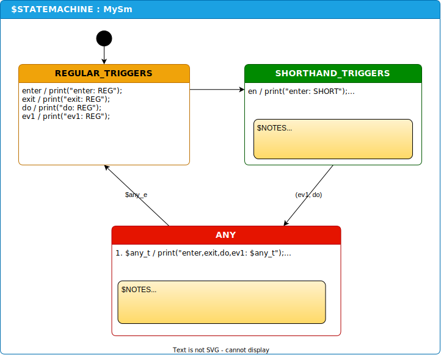

# Assumptions
Assumes that you have gone through basic StateSmith tutorials already.

# TriggerMap is a better solution
See `trigger-map` example or https://github.com/StateSmith/StateSmith/issues/161

This example still has some interesting stuff in it if you want to explore how you can extend StateSmith functionality.

---

# Custom Triggers
This example shows how you can write user code to support custom triggers.

## Shorthands
The first user extension is simple: it just allows you to write `en` instead of `entry` and `ex` instead of `exit`.

## Aggregate Events and Triggers
The second part of the user script adds some more advanced features:

* `$any_t` expands to all triggers (enter, exit and all events used in state machine).
* `$any_e` expands to all events used in state machine.

