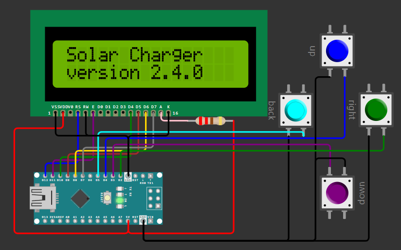
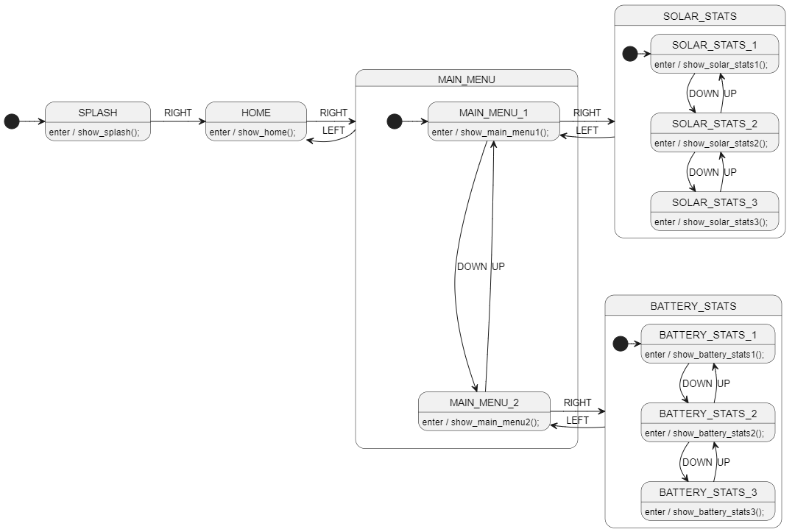

# Prerequisites
Assumes that you have gone through StateSmith [tutorial 3 already](https://github.com/StateSmith/tutorial-3).

# Intro
This project & tutorial will guide you through the process of easily creating a simple nested/hierarchical menu state machine.

It specifically helps you with creating neat and organized PlantUML diagrams.


<!-- 
## Menu UI Layout
```
STATUS: charging
BATTERY: 80%

MAIN MENU 1/2
> solar stats

	SOLAR STATS 1/3
	voltage: 14.5

	SOLAR STATS 2/3
	amperage: 1.3

	SOLAR STATS 3/3
	time: 3h 16min

MAIN MENU 2/2
> battery stats

	BATTERY STAT 1/3
	voltage: 13.1

	BATTERY STAT 2/3
	amperage: -1.3

	BATTERY STAT 3/3
	amp hours: 35.1
```
-->

# Finished Design
With just a bit of additional hints provided to PlantUML, we can get it to create a beautiful diagram. Without the type hints, it can still do decent job ([see here](./docs/alternate.md)).



# Tutorial
Follow along at [tutorial.md](./tutorial.md).

# Simulation
https://wokwi.com/projects/404121058111410177

# Taking It Further
This just shows the basics. There are many things we could do to take it further.

* create a few idle screens instead of "HOME" state
* have the idle screens cycle between each other every 5 seconds
* have main menu timeout to idle screen after 30 seconds

I'll cover more advanced menu designs in the future. When you start wanting to edit settings from a nested menu, it often makes sense to have a separate "Editor" state machine that works along side the main UI state machine.
