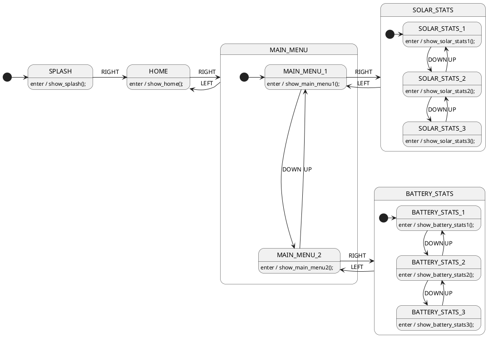

# Complete listing
Your finished PlantUML text should look something like this:

```plantuml
@startuml SolarUiSm

' //////////////////////// STATE ORGANIZATION ///////////////////////
' Note: StateSmith treats state names and events as case insensitive.
' More info: https://github.com/StateSmith/StateSmith/wiki/PlantUML

state SPLASH
state HOME

state MAIN_MENU {
    [*] -> MAIN_MENU_1
    state MAIN_MENU_1
    state MAIN_MENU_2
}

state SOLAR_STATS {
    [*] -> SOLAR_STATS_1
    state SOLAR_STATS_1
    state SOLAR_STATS_2
    state SOLAR_STATS_3
}

state BATTERY_STATS {
    [*] -> BATTERY_STATS_1
    state BATTERY_STATS_1
    state BATTERY_STATS_2
    state BATTERY_STATS_3
}

[*] -> SPLASH

' ///////////////////////// STATE HANDLERS /////////////////////////
' Syntax: https://github.com/StateSmith/StateSmith/wiki/Behaviors

SPLASH -right-> HOME: RIGHT

HOME -right-> MAIN_MENU: RIGHT
MAIN_MENU -left-> HOME: LEFT

MAIN_MENU_1 -down-> MAIN_MENU_2: DOWN
MAIN_MENU_2 -up-> MAIN_MENU_1: UP

MAIN_MENU_1 -right-> SOLAR_STATS: RIGHT
SOLAR_STATS -left-> MAIN_MENU_1: LEFT

MAIN_MENU_2 -right-> BATTERY_STATS: RIGHT
BATTERY_STATS -left-> MAIN_MENU_2: LEFT

SOLAR_STATS_1 -down-> SOLAR_STATS_2: DOWN
SOLAR_STATS_2 -down-> SOLAR_STATS_3: DOWN
SOLAR_STATS_3 -up-> SOLAR_STATS_2: UP
SOLAR_STATS_2 -up-> SOLAR_STATS_1: UP

BATTERY_STATS_1 -down-> BATTERY_STATS_2: DOWN
BATTERY_STATS_2 -down-> BATTERY_STATS_3: DOWN
BATTERY_STATS_3 -up-> BATTERY_STATS_2: UP
BATTERY_STATS_2 -up-> BATTERY_STATS_1: UP

SPLASH: enter / show_splash();
HOME: enter / show_home();
MAIN_MENU_1: enter / show_main_menu1();
MAIN_MENU_2: enter / show_main_menu2();
SOLAR_STATS_1: enter / show_solar_stats1();
SOLAR_STATS_2: enter / show_solar_stats2();
SOLAR_STATS_3: enter / show_solar_stats3();
BATTERY_STATS_1: enter / show_battery_stats1();
BATTERY_STATS_2: enter / show_battery_stats2();
BATTERY_STATS_3: enter / show_battery_stats3();


' //////////////////////// StateSmith config ////////////////////////
' The below special comment block sets the StateSmith configuration.
' More info: https://github.com/StateSmith/StateSmith/issues/335

/'! $CONFIG : toml
[SmRunnerSettings]
transpilerId = "C99"

[RenderConfig.C]
CFileExtension = ".cpp"
CFileIncludes = """
    #include "display.h"
    """
'/
@enduml
```