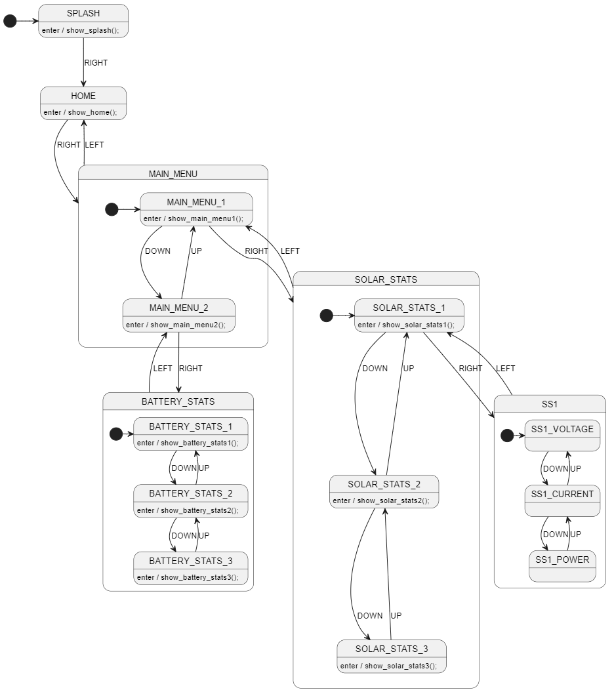
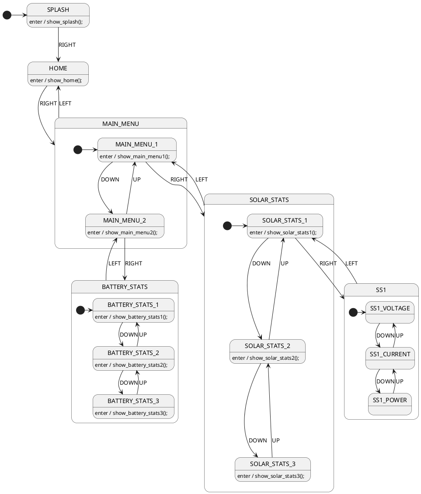
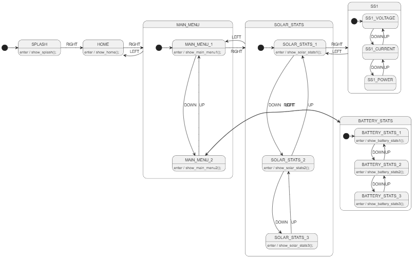
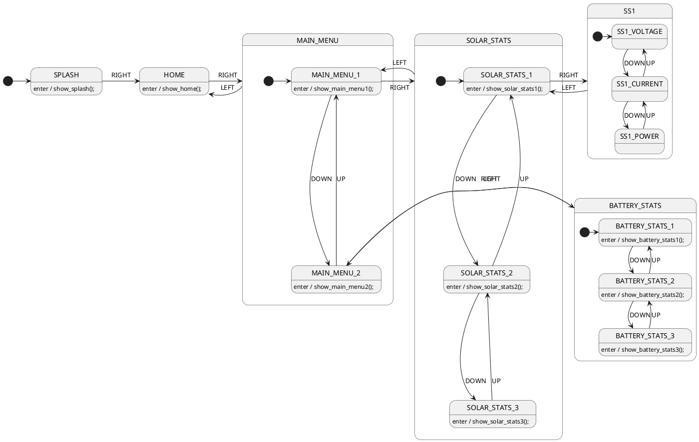
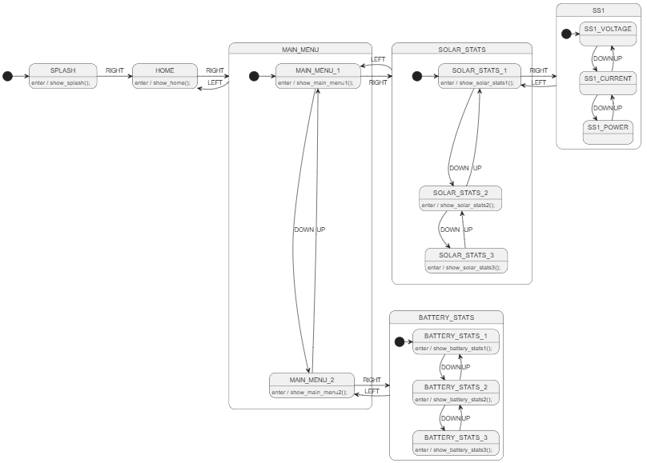
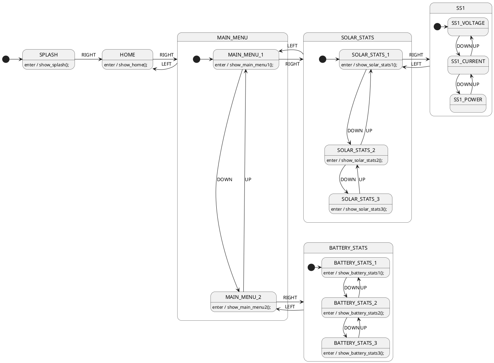

If your design is a lot larger than what is shown here, you may need to make certain arrows longer so that PlantUML has space to layout the drawing. It always seems to want to make the smallest diagram possible.

# Consider Not Using Any Hints
PlantUML does a pretty good job if you just use `-->` for all arrows. It isn't quite as clean, but it is still very readable.





# Before Making Arrows Longer
In the below diagram, we can see that the MAIN_MENU state needs to be taller to make for a cleaner diagram.





# After Making Arrows Longer

> NOTE!!!
> Not yet supported in StateSmith PlantUML grammar. See issue TODO.

Making the below arrows longer makes the MAIN_MENU state taller and allows for a cleaner diagram.

```diff
-MAIN_MENU_1 --> MAIN_MENU_2: DOWN
-MAIN_MENU_2 --> MAIN_MENU_1: UP

+MAIN_MENU_1 ----> MAIN_MENU_2: DOWN
+MAIN_MENU_2 ----> MAIN_MENU_1: UP
```



