# Create States
Take the below list of states and convert each one into a state.

```
SPLASH
HOME
MAIN_MENU
MAIN_MENU_1
MAIN_MENU_2
SOLAR_STATS
SOLAR_STATS_1
SOLAR_STATS_2
SOLAR_STATS_3
BATTERY_STATS
BATTERY_STATS_1
BATTERY_STATS_2
BATTERY_STATS_3
```

```plantuml
state SPLASH
state HOME
state MAIN_MENU
state MAIN_MENU_1
state MAIN_MENU_2
state SOLAR_STATS
state SOLAR_STATS_1
state SOLAR_STATS_2
state SOLAR_STATS_3
state BATTERY_STATS
state BATTERY_STATS_1
state BATTERY_STATS_2
state BATTERY_STATS_3
```

## Nest them accordingly

```plantuml
state SPLASH
state HOME
state MAIN_MENU {
    state MAIN_MENU_1
    state MAIN_MENU_2
}
state SOLAR_STATS {
    state SOLAR_STATS_1
    state SOLAR_STATS_2
    state SOLAR_STATS_3
}
state BATTERY_STATS {
    state BATTERY_STATS_1
    state BATTERY_STATS_2
    state BATTERY_STATS_3
}
```

## Add Initial Transitions `[*] -> `
```plantuml
state SPLASH
state HOME
state MAIN_MENU {
    [*] -> MAIN_MENU_1
    state MAIN_MENU_1
    state MAIN_MENU_2
}
state SOLAR_STATS {
    [*] -> SOLAR_STATS_1
    state SOLAR_STATS_1
    state SOLAR_STATS_2
    state SOLAR_STATS_3
}
state BATTERY_STATS {
    [*] -> BATTERY_STATS_1
    state BATTERY_STATS_1
    state BATTERY_STATS_2
    state BATTERY_STATS_3
}

[*] -> SPLASH
```

If you view your diagram now, you'll see it is taking shape, but still has a ways to go.

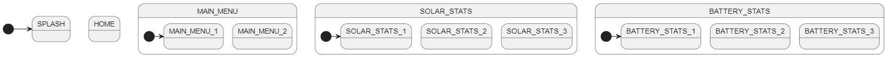


<br>
<br>


# Add Transitions
The general idea is that you use `RIGHT` to go forward into another menu and use `LEFT` to back out of a menu. `UP` and `DOWN` navigate within a menu.

## Splash Screen
For our design, the splash screen goes to the home screen when `RIGHT` is pressed.

```plantuml
SPLASH -> HOME: RIGHT
```

## `HOME` and `MAIN_MENU`
We can advance from `HOME` to `MAIN_MENU` by pressing `RIGHT` and return by pressing `LEFT`.

```plantuml
HOME -> MAIN_MENU: RIGHT
MAIN_MENU -> HOME: LEFT
```

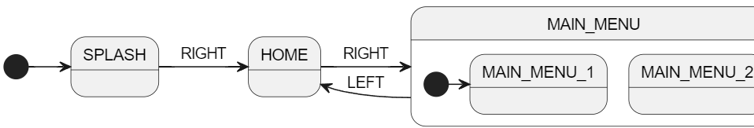

## `MAIN_MENU` sub states
We can from `MAIN_MENU_1` to `MAIN_MENU_2` by pressing `DOWN` and return by pressing `UP`.

```plantuml
MAIN_MENU_1 -> MAIN_MENU_2: DOWN
MAIN_MENU_2 -> MAIN_MENU_1: UP
```

## !IMPORTANT! Provide Direction Hints
Our diagram looks like this so far:

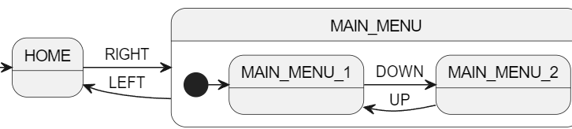

This is good, but the diagram is beginning to sprawl too wide. If we don't provide some hints to PlantUML, the end diagram will be a mess.

Let's tell it that we want the arrows between main menu sub states to point up and down:

```plantuml
MAIN_MENU_1 -down-> MAIN_MENU_2: DOWN
MAIN_MENU_2 -up-> MAIN_MENU_1: UP
```

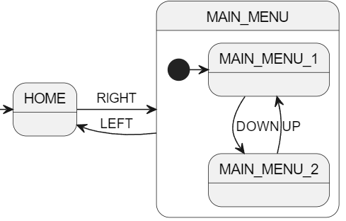


## Connect `MAIN_MENU_1` and `SOLAR_STATS`
We can advance using `RIGHT` and return with `LEFT`.

```plantuml
MAIN_MENU_1 -> SOLAR_STATS: RIGHT
SOLAR_STATS -> MAIN_MENU_1: LEFT
```

Our diagram is looking rough now, but don't worry. We can easily fix this.

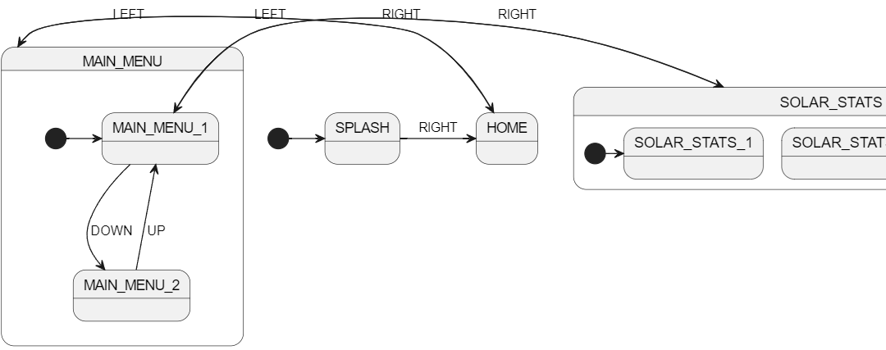

## Add More Direction Hints
Go back and add more type hints to the transitions we already did above:

```planuml
SPLASH -right-> HOME: RIGHT

HOME -right-> MAIN_MENU: RIGHT
MAIN_MENU -left-> HOME: LEFT

MAIN_MENU_1 -down-> MAIN_MENU_2: DOWN
MAIN_MENU_2 -up-> MAIN_MENU_1: UP

MAIN_MENU_1 -right-> SOLAR_STATS: RIGHT
SOLAR_STATS -left-> MAIN_MENU_1: LEFT
```

Much nicer!

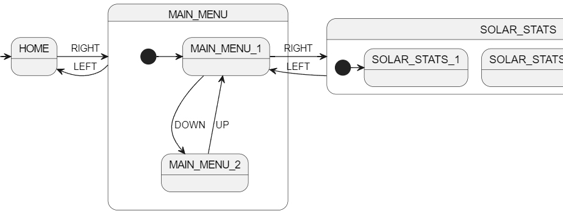

## Connect `MAIN_MENU_2` and `BATTERY_STATS`
```plantuml
MAIN_MENU_2 -right-> BATTERY_STATS: RIGHT
BATTERY_STATS -left-> MAIN_MENU_2: LEFT
```

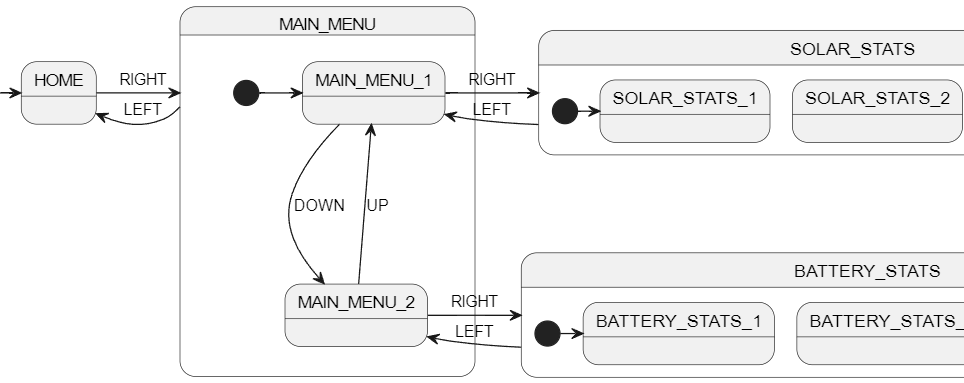

## Connect solar sub states
```plantuml
SOLAR_STATS_1 -> SOLAR_STATS_2: DOWN
SOLAR_STATS_2 -> SOLAR_STATS_3: DOWN
SOLAR_STATS_3 -> SOLAR_STATS_2: UP
SOLAR_STATS_2 -> SOLAR_STATS_1: UP
```

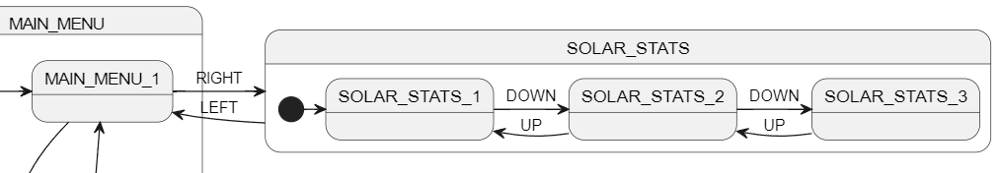

I want these to go up and down. We can do this one or two ways. We can tell PlantUML to use a longer arrow `-->` like below and let it figure it out.

```plantuml
SOLAR_STATS_1 --> SOLAR_STATS_2: DOWN
SOLAR_STATS_2 --> SOLAR_STATS_3: DOWN
SOLAR_STATS_3 --> SOLAR_STATS_2: UP
SOLAR_STATS_2 --> SOLAR_STATS_1: UP
```

But it is often best to just be explicit if we know what we want:

```plantuml
SOLAR_STATS_1 -down-> SOLAR_STATS_2: DOWN
SOLAR_STATS_2 -down-> SOLAR_STATS_3: DOWN
SOLAR_STATS_3 -up-> SOLAR_STATS_2: UP
SOLAR_STATS_2 -up-> SOLAR_STATS_1: UP
```

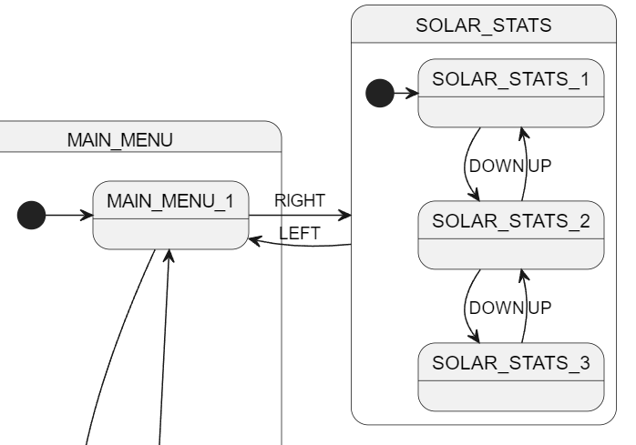

## Battery sub states
Do the same for the battery sub states:
```plantuml
BATTERY_STATS_1 -down-> BATTERY_STATS_2: DOWN
BATTERY_STATS_2 -down-> BATTERY_STATS_3: DOWN
BATTERY_STATS_3 -up-> BATTERY_STATS_2: UP
BATTERY_STATS_2 -up-> BATTERY_STATS_1: UP
```

We are nearly there!

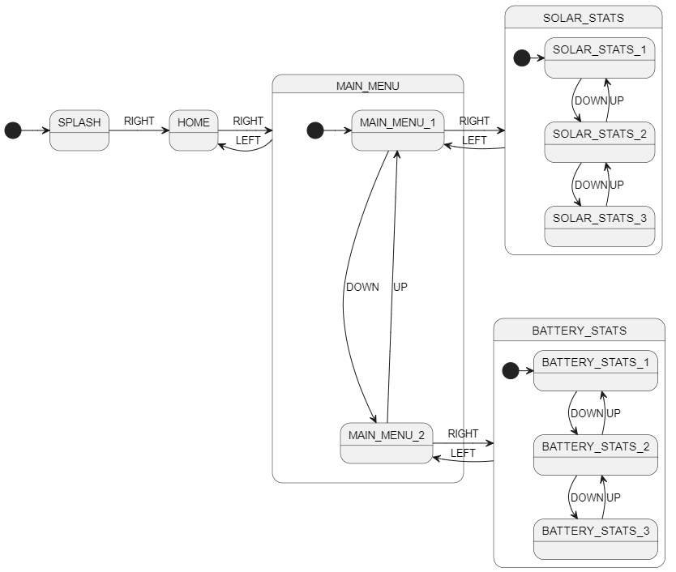


<br>

# Add display code
We want the LCD to be updated when each state is entered.

For example, when the `SPLASH` screen is entered, we want our state machine to call `show_splash()` (provided by `display.c/h`).

Add this PlantUML:
```plantuml
SPLASH: enter / show_splash();
```

 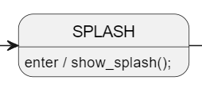

## Do the rest

```plantuml
SPLASH: enter / show_splash();
HOME: enter / show_home();
MAIN_MENU_1: enter / show_main_menu1();
MAIN_MENU_2: enter / show_main_menu2();
SOLAR_STATS_1: enter / show_solar_stats1();
SOLAR_STATS_2: enter / show_solar_stats2();
SOLAR_STATS_3: enter / show_solar_stats3();
BATTERY_STATS_1: enter / show_battery_stats1();
BATTERY_STATS_2: enter / show_battery_stats2();
BATTERY_STATS_3: enter / show_battery_stats3();
```

Our diagram is complete!

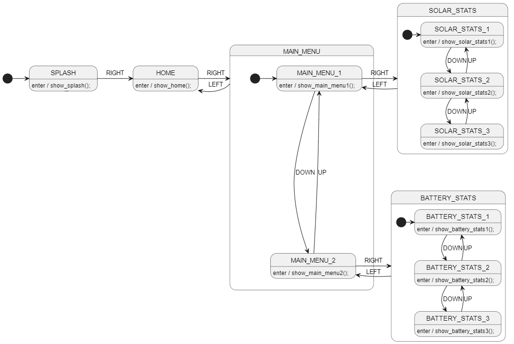


<br>

# Prepare for code generation
At the bottom of our PlantUML file, we need a special comment to tell StateSmith how to generate code for this file.

We need it to do 3 things:
1. transpile using C99
1. tell it to generate a `.cpp` file instead of a `.c` file because we are working with Arduino
1. tell it where to find functions like `show_splash()`

You can find more information on each of the below [settings here](https://github.com/StateSmith/StateSmith/issues/335).

```plantuml
/'! $CONFIG : toml
[SmRunnerSettings]
transpilerId = "C99"

[RenderConfig.C]
CFileExtension = ".cpp"
CFileIncludes = """
    #include "display.h"
    """
'/
```


<br>

# Generate the code!
Run the following command in this directory:
```
ss.cli run -h
```


<br>

# Complete listing

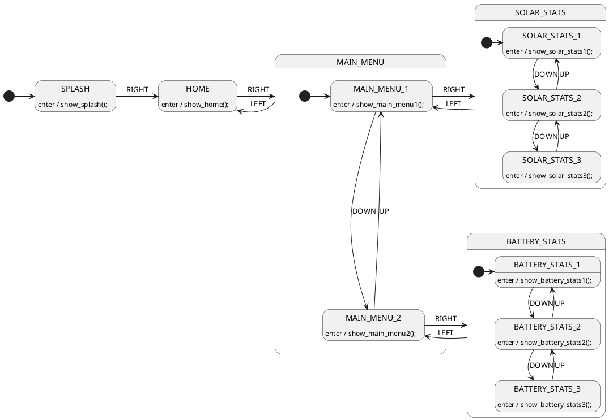