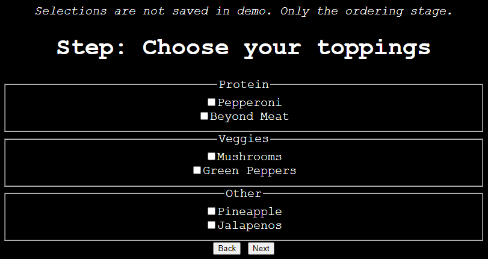

> Assumes that you have gone through basic StateSmith tutorials already.

> This is a bit of an advanced topic. You should be comfortable with the basics first.

This example shows how you can store/restore a state machines state to/from some storage medium (database, file, ...).

To keep this example simple, we use a web browser's [local storage](https://developer.mozilla.org/en-US/docs/Web/API/Web_Storage_API). You can just open `index.html` in a browser.



# Things to notice
* Get to a `PIZZA_BUILD` substate (crust, size, toppings) and refresh the webpage. The state machine will resume where you left off.
* If you are in a `PURCHASING` substate, you can refresh the page and it will resume at the `REVIEW_ORDER` substate (it will intentionally **not** resume at `CONFIRM_ORDER`). This is an arbitrary design choice to show control options.
* Get to `ORDERED` state and refresh your browser. The state will resume at `ORDERED` state.
* There are two code generation scripts (basic and advanced). Read more about `code_gen_advanced.csx` below.

# How does this work?
Check out `index.js` and `storage_stuff.js`. Essentially, the state machine's history field is set to the appropriate value before the state machine is started.

This approach has a number of advantages over simply forcing the state machine into state X:
* The state machine behaves as expected (all ancestor state entry actions are called when resuming state X from History).
* The history behavior is clear in the diagram.
* The diagram designer has control over which states can and cannot be resumed.
* You have control over how to handle state machine design changes.


# Don't Rely on Autogenerated History Id
In the generated code, you'll see an enumeration created for the states tracked by the History vertex:
```js
PizzaSm_HistoryId = 
{
    PIZZA_BUILD : 0, // default transition
    PURCHASING : 1,
    ORDERED : 2,
    CRUST : 3,
    TOPPINGS : 4,
    SIZE : 5,
}
```

These integer values will likely change if you add/remove states. They might also change with StateSmith versions. It's safer to store our own mapped value instead. In this example, we store a string because it is easy to understand, but you could store your own integer instead.

## What if a state name changes?
In object oriented languages (like Js, C#), you can use the StateSmith autogenerated `PizzaSm_HistoryId` enumeration to provide the strings to store, but what if a state like `SIZE` is renamed to `PIZZA_SIZE`? The value stored in the storage medium/database will be `SIZE` and won't match the new enumeration value name `PIZZA_SIZE`. The script `code_gen_advanced.csx` will detect this.

Another approach is to provide an explicit mapping of stored IDs to history state IDs like this:
```js
const mappingArray = [
    new MappingElement("PIZZA_BUILD", PizzaSm.PizzaSm_HistoryId.PIZZA_BUILD),
    new MappingElement("PURCHASING",  PizzaSm.PizzaSm_HistoryId.PURCHASING),
    new MappingElement("ORDERED",     PizzaSm.PizzaSm_HistoryId.ORDERED),
    new MappingElement("CRUST",       PizzaSm.PizzaSm_HistoryId.CRUST),
    new MappingElement("TOPPINGS",    PizzaSm.PizzaSm_HistoryId.TOPPINGS),
    new MappingElement("SIZE",        PizzaSm.PizzaSm_HistoryId.SIZE),
];
```

Then if `SIZE` is renamed to `PIZZA_SIZE`, the mapping array can be updated to below and we don't break the storage medium/database:
```js
//...
new MappingElement("SIZE", PizzaSm.PizzaSm_HistoryId.PIZZA_SIZE),
```

## What if a tracked state is added or removed?
See `code_gen_advanced.csx` for a solution. It detects changes, fails the code gen and prints a message like below:
```
Exception UpdateRequiredException : History tracked states modified. Update manual mappings in .js & .csx! Changes: +PIZZA_SIZE, -SIZE, 
```

# History State Info
* https://github.com/StateSmith/StateSmith/blob/main/docs/history-vertex.md

# Other Options
This isn't the only way to accomplish restoring a state machine from storage. You can also add custom state machine behavior from your code generation scripts.

# How to use
Open `index.html` in a browser.

# Run code gen
Run regular or advanced code gen with these commands in this directory:
```
dotnet-script code_gen.csx
dotnet-script code_gen_advanced.csx
```