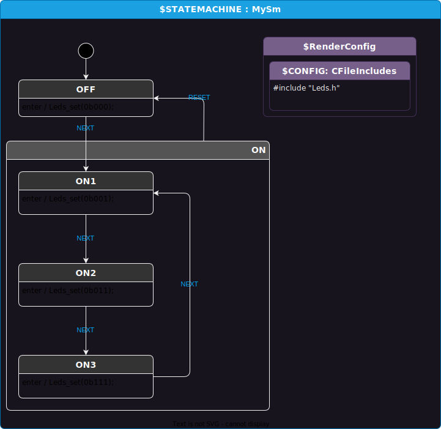

# Intro
This little example shows how to simply log state and event info.

The example is written in `C`, but the same idea is easy to adapt to any language.
Before sending an event to the state machine, you grab a temp copy of its state ID
so that you can check if it changed after the event dispatch.

If you are looking for more powerful logging abilities, see the `modding-logging` example.

# User code of interest
```c
MySm_StateId prev_state_id = sm->state_id;

printf("Sending `%s` event to sm\n", MySm_event_id_to_string(event_id));
MySm_dispatch_event(sm, event_id);

if (prev_state_id != sm->state_id)
{
    printf("State changed from `%s` to `%s`\n", MySm_state_id_to_string(prev_state_id), MySm_state_id_to_string(sm->state_id));
}
```

# How to use
CD to this directory.

Run code gen:
```
dotnet script MySm.csx
```

You can compile and run with gcc with this command:
```
gcc main.c MySm.c Leds.c; ./a.out
```

# Design

