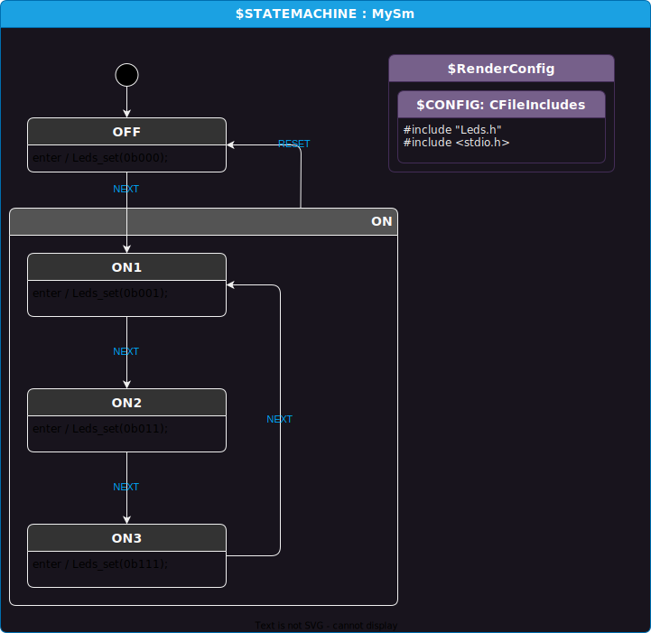

# Intro
This little example shows how to easily customize code generation to log state enter and exit:

```
Sending `RESET` event to sm
<-- Exited ON3.
<-- Exited ON.
--> Entered OFF.
LEDS: 000
```

The example is written in `C`, but the same idea is easy to adapt to any language.

If you are looking for more powerful logging abilities/customization, see the `modding-logging` example.

# User code of interest
See `MySm.csx` file.
```cs
void LoggingTransformationStep(StateMachine sm)
{
    // The below code will visit all states in the state machine and add custom enter and exit behaviors.
    sm.VisitTypeRecursively<State>((State state) =>
    {
        state.AddEnterAction($"printf(\"--> Entered {state.Name}.\\n\");", index:0); // use index to insert at start
        state.AddExitAction($"printf(\"<-- Exited {state.Name}.\\n\");"); // behavior added to end
    });
}
```

# How to use
CD to this directory.

Run code gen:
```
dotnet script MySm.csx
```

You can compile and run with gcc with this command:
```
gcc main.c MySm.c Leds.c; ./a.out
```

# Design

