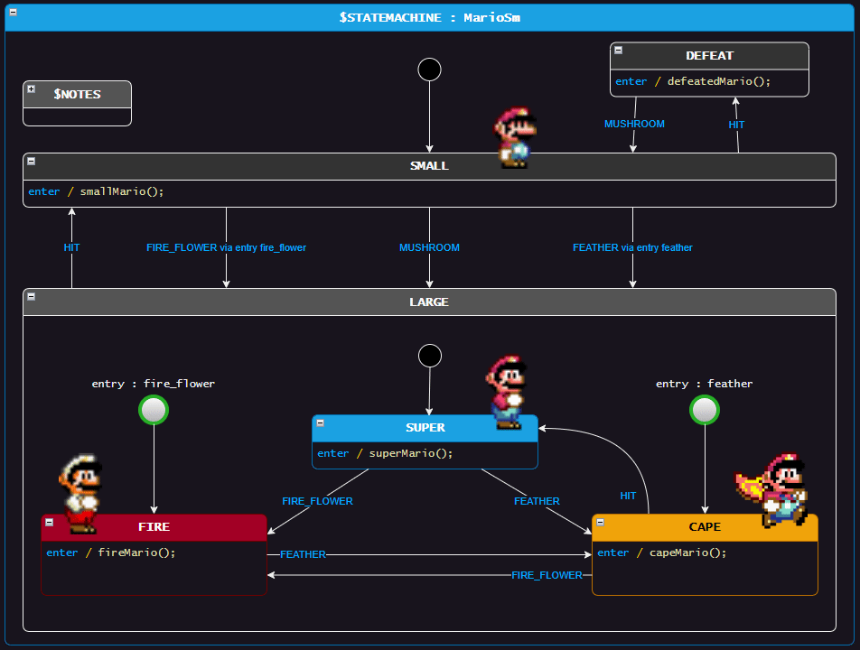
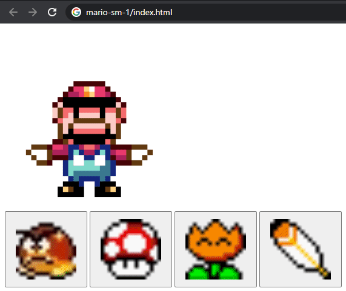

> Assumes that you have gone through basic StateSmith tutorials already.

# Things to notice
* Video games are awesome.
* Shows that you can embed images in a draw.io diagram and StateSmith will ignore them. GIFs too :)
* Uses a regular xml draw.io file for the design instead of an svg. [Both are good](https://github.com/StateSmith/StateSmith/wiki/draw.io:-file-choice).

# How to use
Open `index.html` in a browser.

# Run code gen
Run command `dotnet-script code_gen.csx` in this directory.

# Attribution
Images from https://www.mariowiki.com/Super_Mario_World and tenor.com
