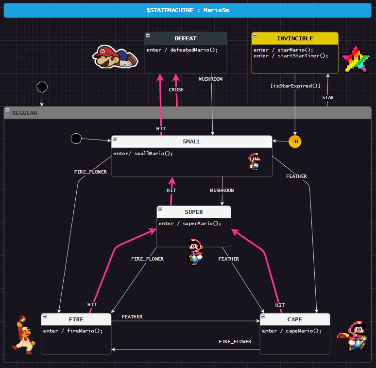

> Assumes that you have gone through basic StateSmith tutorials already.

# Requires StateSmith lib version 0.12.0 or higher
This example uses new StateSmith `draw.io` features.

# Things to notice
- video game example that responds to events and also timeouts.
- uses history to go back to previous state after star wears off.
- you can embed images/gifs in the drawio design.

# Run code gen
Run with `ss.cli run -h`.

# How to use
Open `index.html` in a browser.

# Attribution
Images from https://www.mariowiki.com/Super_Mario_World and tenor.com
