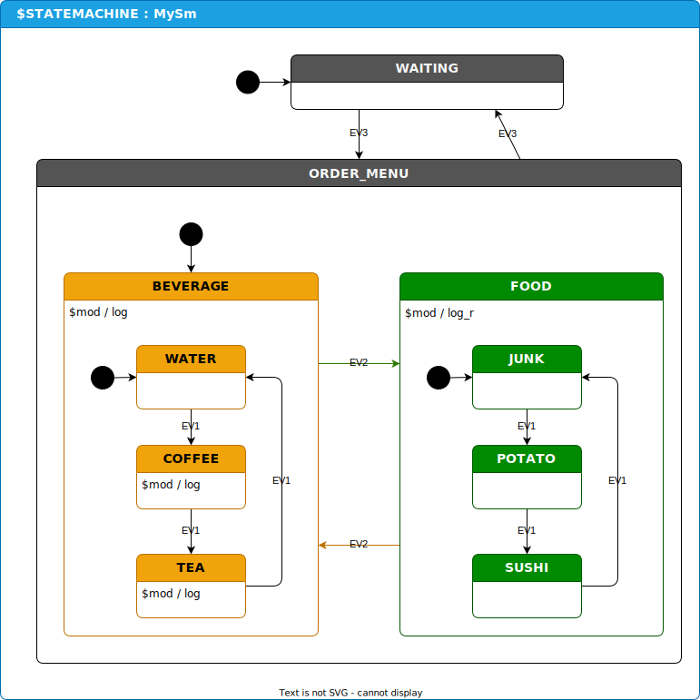

# Assumptions
Assumes that you have gone through basic StateSmith tutorials already.

# User Custom Logging
Open this directory with `vscode`.

This example shows how to use a custom user script to modify the state machine before code generation runs to add custom logging.

This is achieved with a few modding behavior lines in the diagram and [MySm.csx](./src/MySm.csx)
* `$mod / log` - logs state name on enter and exit.
* `$mod / log_r` - same as above, but it also acts recursively on all nested states.

Feel free modify the user script to change the annotations!

StateSmith may adopt some kind of functionality like this into the core library (pending user feedback). Now is a good time to play with the idea and help design how it should/could work.

# Things to Explore

## Limit Recursive Logging
Maybe you want want to add another annotation to omit states from the `log_r` recursive logging?

The annotation to disable logging could look whatever you decide:
* `log -d`
* `log_off()`
* `Save our trees! Stop the logging please!` *(can you tell I've been writing documentation too long?)*

## Verbosity and Tagging
Maybe you want to add logging levels like `log(TRACE)`, `log(DEBUG)`, ... so that you can select the logging verbosity when the state machine is generated?

Maybe you want to add tagging like `log(#FOOD)` so that you can easily filter which sections of the state machine will be logged when the state machine is generated?

# How Does This Work?
https://github.com/StateSmith/StateSmith/wiki/How-StateSmith-Works

# Experimental API
This is an experimental feature. User modding scripts will supported going forward,
but some of the internal StateSmith API that the modding scripts access may change.

# Background
Logging on state transitions is one of the areas that StateSmith is weak out of the box. This is a design choice for StateSmith - we prioritize high performance generated code that is easy to read and debug.

The predecessor to StateSmith used to have a callback function that was called on any transition, but I eventually removed it. Many state machine designs have high frequency transitions between a few states that you typically want to ignore for logging so that you don't fill up your buffer/file with transitions you don't care about. With the callback solution, you have to write code that filters these transition callbacks at runtime and that significantly slows down your state machine execution. It also isn't apparent on the diagram which transitions are being logged.

The approach we are exploring now is adding a few modding annotations to the diagram.
