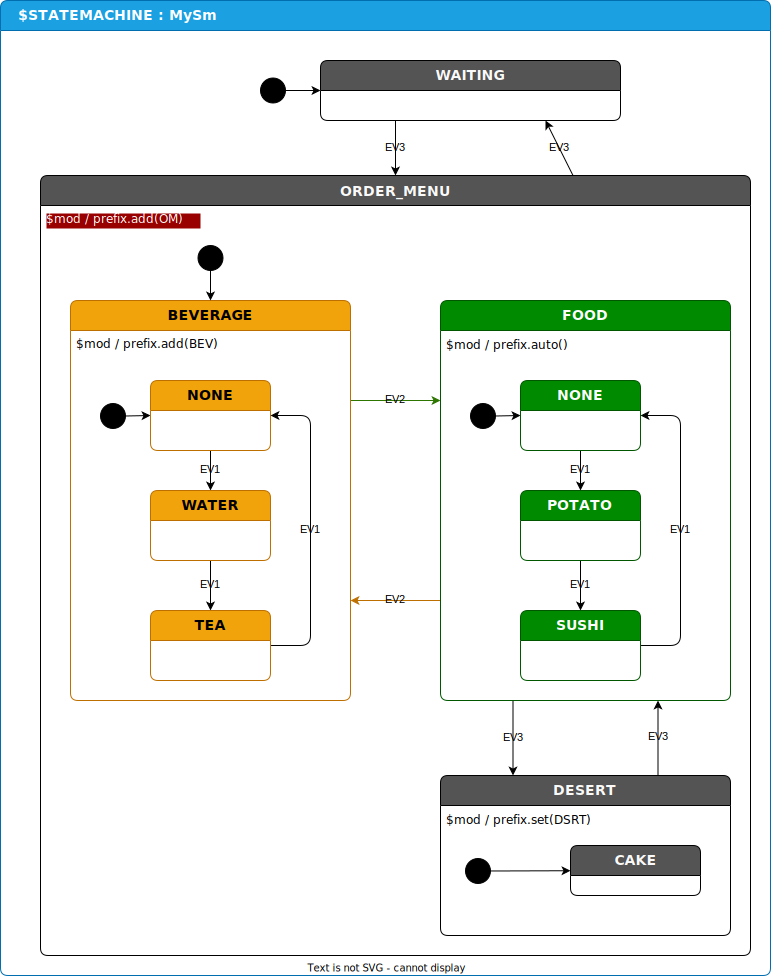

# Assumptions
Assumes that you have gone through the [example-drawio-1](https://github.com/StateSmith/example-drawio-1) walk through already.

# State Name Prefixing
Open this directory with `vscode`.

This example shows how to use prefixing modding.
https://github.com/StateSmith/StateSmith/wiki/$mod-prefix

Simply run the code generation script and notice the generated state names in `MySm.h`.

Note the different ways you can use prefix commands: `.add()`, `.auto()`, `.set()`

```c
enum MySm_StateId
{
    MySm_StateId_ROOT = 0,
    MySm_StateId_ORDER_MENU = 1,
    MySm_StateId_OM__BEVERAGE = 2,
    MySm_StateId_OM__BEV__NONE = 3,
    MySm_StateId_OM__BEV__TEA = 4,
    MySm_StateId_OM__BEV__WATER = 5,
    MySm_StateId_OM__DESERT = 6,
    MySm_StateId_DSRT__CAKE = 7, // note how prefix.set() allowed it break out of "OM" prefix.
    MySm_StateId_OM__FOOD = 8,
    MySm_StateId_OM__FOOD__NONE = 9,
    MySm_StateId_OM__FOOD__POTATO = 10,
    MySm_StateId_OM__FOOD__SUSHI = 11,
    MySm_StateId_WAITING = 12,
};
```


