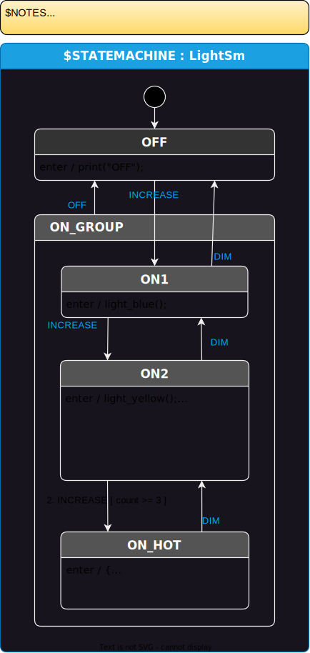
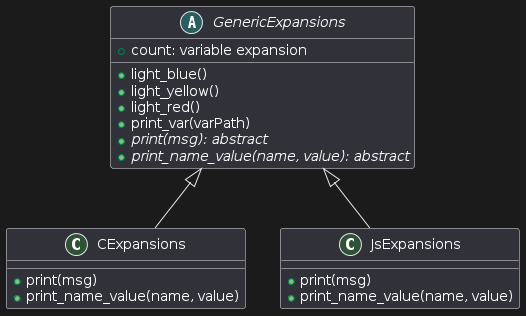
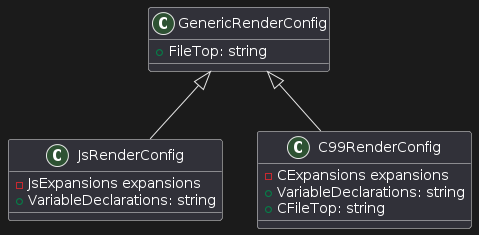

# Multi-Language-1 Example

Assumes that you have gone through basic StateSmith tutorials already. This one is generally more advanced. You will probably want [.csx intellisense](https://github.com/StateSmith/StateSmith/wiki/Using-c%23-script-files-(.CSX)-instead-of-solutions-and-projects#setup-vscode-for-debugging-c-script-files-and-intellisense) setup for this.

The interesting code is in the .csx file [LightSm.csx](LightSm.csx).

This example shows how you can use a single state machine diagram (below) to generate state machines in multiple languages (C & JS here).



It also shows a more advanced usage of expansions and render configs to efficiently support multiple languages.

## Details
Expansions are just C# code that can utilize inheritance or composition if you want. In the example below, you can see that `GenericExpansions` is an abstract class that provides the majority of common expansions. There are only a few expansions specific to each language (for printing).




Similarly, RenderConfig objects can also utilize inheritance (although it is generally less useful). It simply allows you to define the `FileTop` attribute in a single place, but you could also do that without inheritance by using a `const` string.




### Other Notable Points:
* An `SmRunner` object is created and run for each language.
* Expansions can be added to a render config as a field (composition).
    - they don't need to be defined inside the render config class.


<br>

## Alternate Syntax
If you want, you can put the language specific expansion inside the render config itself:

```csharp
// RenderConfig for JavaScript
public class JsRenderConfig : GenericRenderConfig, IRenderConfigJavaScript
{
    string IRenderConfig.VariableDeclarations => """
        count : 0, // variable for state machine
        """;

    // expansions for JS
    public class JsExpansions : GenericExpansions
    {
        public override string print(string msg) => $"console.log({msg})";
        // ...
    }
}
```


<!--
https://www.plantuml.com/plantuml/duml/hP7FQe0m3CRlVOeSbSqNa1s4CGOxxGqarg25MgM9-uFptLVdEhk9jnKAuSlNNx-GYWMzp8DLsB1ur0BQ8ZCyaYDlzCFRX8xDw1WM1U7SW1vd9oMye3VOM0AAbk--DLqlTMDdol9VqZjPExx-4JsrFyhaZPCwWBDmdr7wlR74Q6lqP0DtUGbHlt3L3WSAk2t9Ljx2Lvq-N9NQnxq_3vfyTGZNr8FrnFy2K-SLt7qKHHhrof8cK1MvDYpu4m00
-->

<!--
@startuml
abstract class GenericExpansions {
    + count: variable expansion
    + light_blue()
    + light_yellow()
    + light_red()
    + print_var(varPath)
    {abstract} + print(msg): abstract
    {abstract} + print_name_value(name, value): abstract
}

class CExpansions {
    + print(msg)
    + print_name_value(name, value)
}

class JsExpansions {
    + print(msg)
    + print_name_value(name, value)
}


GenericExpansions <|-- CExpansions
GenericExpansions <|-- JsExpansions
@enduml
-->


<!-- 
https://www.plantuml.com/plantuml/duml/SoWkIImgAStDuKhEIImkLd1FpKijoamEIirBIIropizBoqnNgEPI009j1RVCdDIG_08hXUAIeioyTAvQBgWchs8iwdM1mguL1ObvnPdvUSKAgN0crBImnABCnAISL9TKe255YIKWAKoZdIqjiPhjJAxHK2NEM3o3pUysDRgwQFx3gGxTiLmEG0umQ040
 -->
<!-- 
@startuml
class GenericRenderConfig {
    + FileTop: string
}

class JsRenderConfig {
    - JsExpansions expansions
    + VariableDeclarations: string
}

class C99RenderConfig {
    - CExpansions expansions
    + VariableDeclarations: string
    + CFileTop: string
}

GenericRenderConfig <|-- JsRenderConfig
GenericRenderConfig <|-- C99RenderConfig
@enduml
 -->
