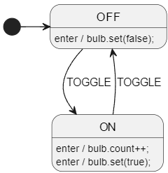

# Multi-Language-2: Python & C++
> [🎞️ Video walkthrough available on youtube](https://www.youtube.com/watch?v=a3sIHLsSP9c)

> This is a more advanced topic. Not too difficult, but you should already understand the basics of StateSmith first. Specifically [tutorial 2](https://github.com/StateSmith/tutorial-2) which covers using .csx files. You will also probably want [.csx intellisense](https://github.com/StateSmith/StateSmith/wiki/vscode-csx) setup for this.

Let's use a single diagram to generate code for two very different languages: Python and C++.



How can this possibly work? They differ in a lot of ways:

| Code                 | C++               | Python                 |
| -------------------- | ----------------- | ---------------------- |
| statement terminator | semicolon         | no semicolon           |
|                      | `do_stuff();`     | `do_stuff()`           |
| inherited members    | implicit `this->` | requires `self.`       |
|                      | `parent_method()` | `self.parent_method()` |
| increment            | `count++`         | `count += 1`           |
| booleans             | `true`            | `True`                 |
| ...                  |                   |                        |

You can solve this in a number of ways, but I often choose a "primary" language for my diagram (like C++ in this case) and then translate to other languages.

Note that both `py` and `cpp` directories have working examples that you can interact with.

<br>

# Preprocess
You could choose to preprocess the diagram before using it with StateSmith. This is a totally valid option, but probably better suited to PlantUML diagrams. I wouldn't recommend it with draw.io diagrams. Especially not draw.io svg diagrams which are encoded :P

<br>

# Custom Transformations
We can add a custom transformation step to the StateSmith pipeline with a few lines of code.

It simply visits each vertex inside the state machine graph and converts user action code and behavior code from C++ syntax to Python syntax.

```cs
transformationPipeline.Insert(0, new TransformationStep(action: (stateMachine) =>
{
    stateMachine.VisitRecursively((stateMachineVertex) =>
    {
        foreach (var behavior in stateMachineVertex.Behaviors)
        {
            behavior.actionCode = PythonifyDiagramCode(behavior.actionCode);
            behavior.guardCode = PythonifyDiagramCode(behavior.guardCode);
        }
    });
}));

string PythonifyDiagramCode(string str)
{
    str = str.Replace(";", "");
    str = str.Replace("++", " += 1");
    str = str.Replace("/*", "#");
    str = str.Replace("//", "#");
    str = str.Replace("true", "True");
    str = str.Replace("false", "False");
    return str;
}
```

<br>

# Tips
* using composition instead of inheritance can help here. We use a `bulb` variable instead of inheriting from a base class. If you want to use inheritance, you can use `this->` everywhere in your diagram and easily translate that to `self.` for python.
* when choosing your "primary" diagram language, it is often best to use the most "picky" or detail oriented language. Makes translations a lot easier when you just need to remove info/syntax than to try and infer it.