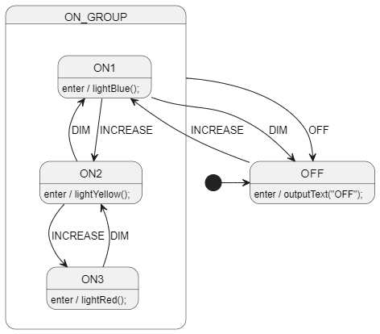
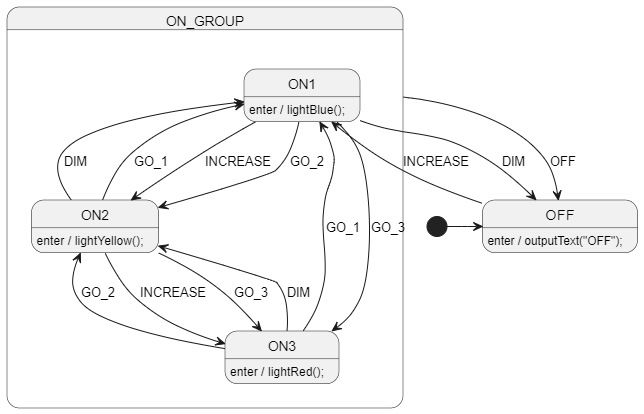
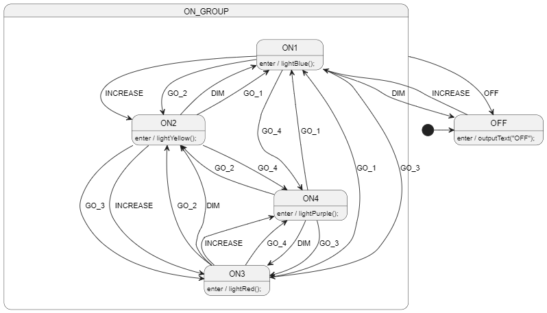
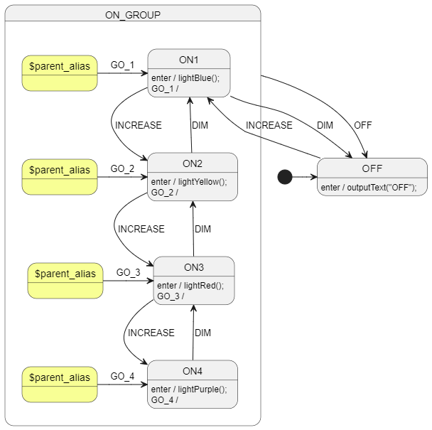

# Parent Alias 1
The parent alias node can be very helpful in a number of situations.

# Scenario
# Simple Light Controller
Let's assume that we have a light controller with 3 ON states:
- ON1 (blue light)
- ON2 (yellow light)
- ON3 (red light)

The user can press buttons to INCREASE (towards red) or DIM (towards blue) the light color.

We can handle this easily.

# Problematic Client Request 1
HOWEVER, the client has now requested that the user can also command a specific color.

Every on state now has to be able to transition to every other on state.

Ugh. We can do this, but it's getting a bit messy.

# Problematic Client Request 2
The client now wants to add a new color to the mix: purple.

Combined with the previous request, this is getting out of hand.

We have some options:
- (bad) convince client that 3 colors is enough
- (bad) explain that code structure will need rewriting to accommodate this
- (bad) just suffer through the mess and hope for the best (please no 5th color!!!)
- adapt your state machine approach

# Parent Alias Solution
Here's a particularly elegant solution using the parent alias node.

## How does it work?
The `$parent_alias` nodes are an alias to their parent state (the `ON_GROUP` state).

They are entirely a convenience for making a cleaner diagram. You could just as easily have the transitions originate directly from the `ON_GROUP` state, but PlantUML wouldn't draw that as nicely.

We essentially have a transition from the parent group to each of its child states.

Here's a quick example:
- assume we are in the `ON1` state.
- the user sends event `GO_4`.
- state `ON1` doesn't have a handler for `GO_4`, so it bubbles the event up to its parent `ON_GROUP`.
- `ON_GROUP` has a handler for `GO_4` and starts the transition to `ON4`:
    - `ON1` is exited
    - `ON4` is entered
    - Note that `ON_GROUP` is not exited or entered
- we are now in the `ON4` state.
- the user sends the same event `GO_4` (because we all know users are like this).
- `ON4` has a blank handler for `GO_4`, so it "eats" the event and prevents it from bubbling up to `ON_GROUP`.
    - If we didn't have this, it would still work, but `ON4` would exit and then re-enter itself.

Our state machine has **exactly** reproduced the behavior of the other designs, but in a much more elegant way.

# Downsides
Currently the StateSmith generated simulator files like `Alias4.sim.html` don't **show** the transitions from parent to child very well (they are kinda hidden). This is due to a `mermaid.js` [limitation](https://github.com/StateSmith/StateSmith/issues/306).

However, the transitions are there and work as expected. Just pay attention to the sidebar in the simulator to see the transitions.

# Try It Out
Try out the various simulator `.sim.html` files to play with each design.

# More Info
If you haven't seen transitions like this where a parent switches from one child to another, it can be a bit confusing at first. But it's a very powerful tool in your state machine toolbox.

UML calls these transitions "local transitions" because they don't exit the parent state. They are just transitions within the parent state.

You can read more about "local transitions" and StateSmith here: https://github.com/StateSmith/StateSmith/blob/main/docs/diagram-features.md#uml-difference---local-transitions-only-for-now
