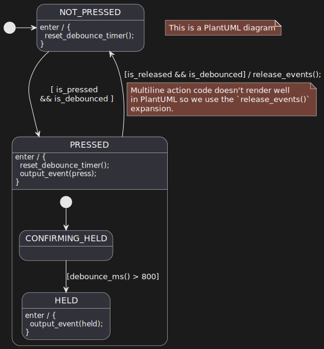
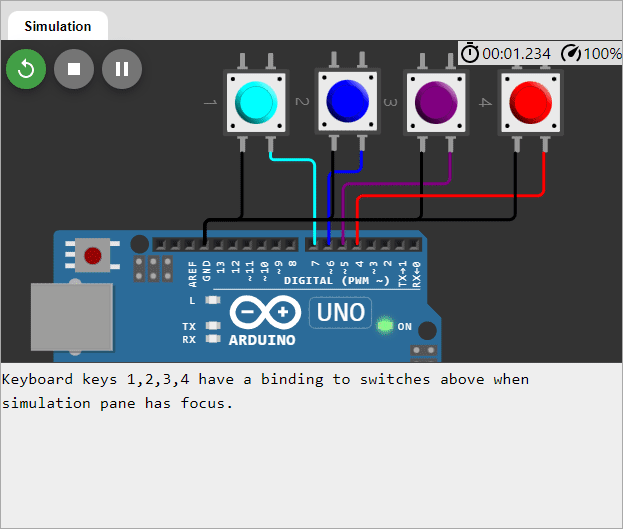

> Assumes that you have gone through basic StateSmith tutorials already.

# Things to notice
* PlantUML is awesome.
* Arduino/C++ is awesome.
* Multiple state machines running at the same time (one for each button).

# Visualization of [ButtonSm1Cpp.puml](./ButtonSm1Cpp.puml)
This is a basic button debouncing state machine that also detects when a button is "held".

# How to use
Test with Arduino or this [online Arduino simulator project](https://wokwi.com/projects/341751694242087508).

# Run code gen
Run command `dotnet-script code_gen.csx` in this directory.

# PlantUML online
See [this link](http://www.plantuml.com/plantuml/dumla/fLBHRjf047o_hnZb8K2b0ErJbRHff8QsI854IVeKa7FnRV29ynwwMvT64VzU6mC1zwcgPCdsxcfcTcOlekWWHUxKmxifJiunlhvFRcu7TtU3IrNsXFOhU5Ku-3y5iL103wyJ1W95aiJGaoyufKHiJg7TEPlmIgsKOY-4e_lCHfIFnetJB3z7Lp1MpuBEZw0Znk_LXdUVyr_v05_8ef24VX5BUr4Enbg70duChXf8ZV6CdDbDhtqnVicbEL-lnz-6jwFX-7jIWIWqAxl93SV3JbiUsnsSusE_FwsywBNKs0kTgY5INpZ3BS6C198HdiZv9IHeZbQiPuX7hYNDrjsNWTaQrdspCAstqSxEEEwXE5s-bMPJ8imfmWeo7Km56KYRBYuzHMX-yKoOiryYgxWz73rB3GShNzGsW9F34wbMj349v4X7CZW-XesxGCnqQwzzHllGYa-VyQ7VxzJjXl-Y5tM8gx-YsJ3LwRHwwZ-4RNerS2dfh3vGpt2MvoN0g71Yos-2JjSvfDuGZATOfHM83GKioRa9MtwB8lgoY2BIEeR79itZXEdteihMSrUfVStL3dlwAyNhooKpOJHNm5HT49iYTty0).

