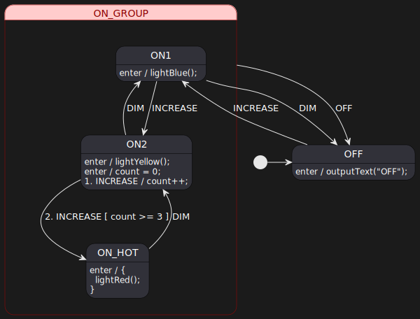

> Assumes that you have gone through basic StateSmith tutorials already.

# Things to notice
* PlantUML is awesome.

# Visualization of Light State Machine

# How to use
Open `index.html` with a browser.

# Run code gen
Run command `dotnet-script code_gen.csx` in this directory.

# PlantUML online
See [this link](http://www.plantuml.com/plantuml/dumla/ROz1IyD048Nlyok6Ugb2KNlK4fhKHWhQIgi74IbBTrfBDhjbCukA-D-TJI14xHn2zdrltviTLwmyXzBWtNxtngiIgc9l3ygh4WKnuHTWvhmcFt76-T78sNN5duQI14_Iz49636fJxBmBLXynRRSR6S3SMVwFjVA59ms_MZ0paWZV0CqEYpnlV-Vhs-NYwQ4R4dSKS8bNI9R9upcQ-9hC1EgVNjTm-1S-ap7kFUBOytBsYeEaAP9Fn-m27m8_qWVtUq9wSY4Q1k9kAcVpoNAQhgO0yLpBmuxSgdNgpUmUO4nMXzBy0000).

