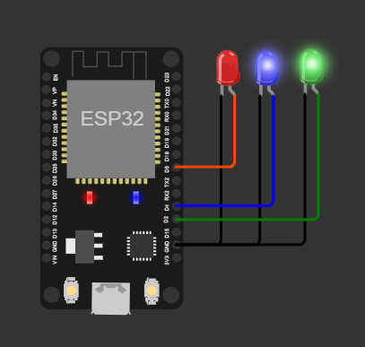

# Intro
This little example shows one possible way to efficiently address concurrency with the help of an RTOS queue.
This example uses FreeRTOS, but the same approach should work for Zephyr OS and others.

The interesting part of this example is that the control task achieves two goals:
1. Dequeue and dispatch events to the state machine with near zero latency. There is no wasted CPU or time.
2. Dispatch `DO` events to the state machine at a fixed interval without an additional task.

# Wokwi Interactive Demo
> ⚠️ I believe wokwi broke old esp32 projects. Maybe a config setting change?
See https://wokwi.com/projects/371538917092107265



# Assumptions
Assumes you have already completed [tutorial-2](https://github.com/StateSmith/tutorial-2) and have basic working knowledge of how to use StateSmith.

# User code of interest
```c
static void send_events_to_state_machine() {
    bool is_do_event_pending;
    uint32_t ms_to_next_do_event_interval = IntervalTimer_update(&timer, &is_do_event_pending, get_ms_since_boot());

    if (is_do_event_pending) {
        dispatch_event(MySm_EventId_DO);
    }

    // This task doesn't need an explicit sleep because it will block on the queue receive.
    // It will unblock when an event is added to the queue or when the timeout expires.
    // The timeout is set so that it corresponds to the next interval for a DO event to be dispatched.
    enum MySm_EventId event_id;
    if (xQueueReceive(event_queue, &event_id, pdMS_TO_TICKS(ms_to_next_do_event_interval)) == pdTRUE) {
        dispatch_event(event_id);
    }
}
```

If you have lots of resources, you can simplify the code and skip calculating the interval timeout.
Just use an RTOS timer or task to run at your desired `DO` event interval and have it add `DO` events
into the event queue. Make sure your queue is large enough for the additional `DO` events.

Many embedded projects that have safety or other concerns will limit/avoid dynamic sources of error like queues and malloc/free.
You don't need to use queues, dynamic memory or an RTOS with StateSmith, but they can be really helpful for certain applications.

# Diagram
The state machine will advance between LED states after a certain amount of time (checked during the `DO` event)
or when the `NEXT` event is received.


